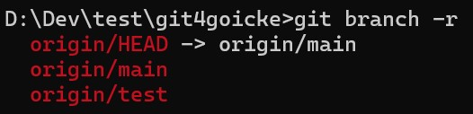
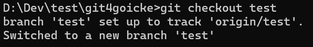

## Branch auswählen (optional)
Falls ein anderer Branch verwendet werden soll:  
`git branch -r` 
> zeigt alle verfügbaren branches an

## Branch wechseln (optional)
um den branch zu wechseln:  
`git checkout <branch>` 
 
Beispiel: 
`git checkout test` 

   
[Home](https://git.fullme.sh/)  
[ Nächste Seite: Repository aktualisieren](./repo-fresh.html)