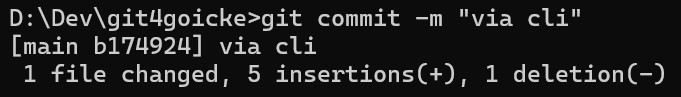
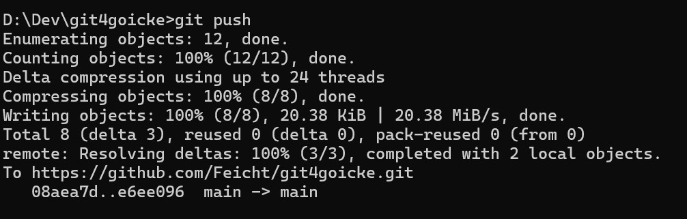

## File hinzufügen
Dateien "Stagen" (zur Veröffentlichung hinzufügen)  
`git add <file>`
 
 

## File commit
Datei in einem Commit hinzufügen (eine Sammlung an Änderungen)  
`git commit -m "<Nachricht für den Commit>"`
 
Beispiel:  
`git commit -m "Das ist ein Test"`
 
Output:  
> [main a987158] add  
> 1 file changed, 3 insertions(+), 1 deletion(-)

 

## Push
Commit (Sammlung an Änderungen) an Repository senden  
`git push`
 

 