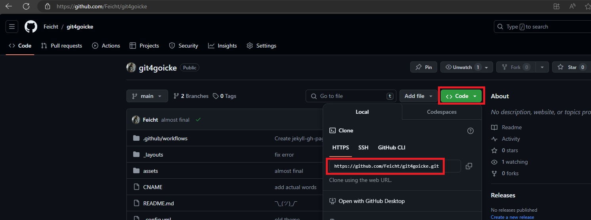
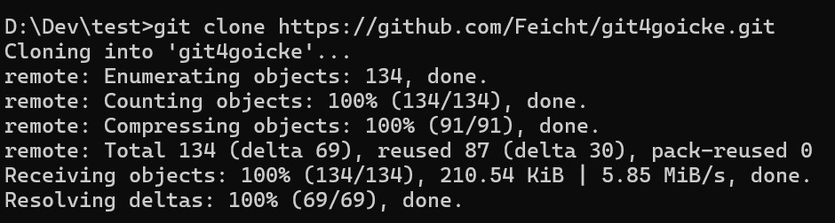

## Repo finden
Herausfinden, wo das Repository zu finden ist.  
github.com / gitlab.domain.xyz 
 
HTTPS:// Git-Server / Ordner / Repository .git 
Beispiel: https://github.com/User/Repository.git 

 
 
CMD-Befehl Git 
`git clone <repo> [<dir>]` 
 
Beispiel:  
`git clone <repo> C:\Temp\xyz` 
> Ohne Angabe des Pfades wird das Repo in das Verzeichnis kopiert, in das aktuelles Verzeichnis (der CMD (dir))

   
[Home](https://git.fullme.sh/) 
[Nächste Seite: Branches](./branch.html)