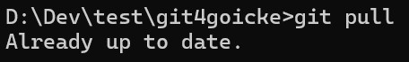
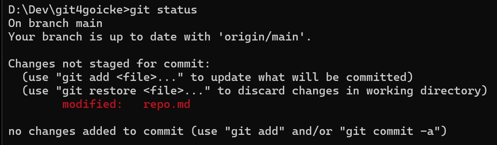
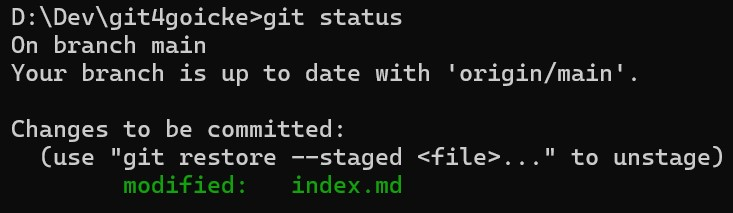
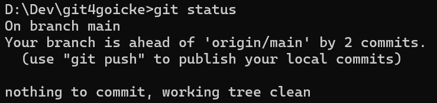

# Git Status
Der Status zeigt immer den aktuellen Stand an und was als nächstes getan werden kann. 
`git status`
 

#### Alles ist aktuell

 

#### Lokale Änderung ohne git add

[=> Mach git add](./commit.html)
 

#### Lokale Änderung mit git add, ohne git commit

[=> Mach git commit](./commit.html)
 

#### Lokale Änderung mit git add, mit git commit, ohne git push

#
[=> Macht git push](./commit.html)
   
[Home](https://git.fullme.sh/) 
[Nächste Seite: Änderungen veröffentlichen](./commit.html)